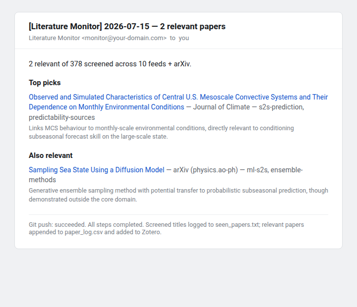

# Literature Monitor Template

A daily AI literature monitor. A scheduled Claude agent screens the RSS
feeds of your chosen journals against your written research scope, emails
you a digest of relevant papers, files them into your Zotero library with
full metadata and open-access PDF links, and commits an auditable log to
this repo. You read one short email a day instead of eleven tables of
contents.



The digest groups score-4 papers under "Top picks" and score-3 papers under
"Also relevant". Each entry links the title, names the journal and topic
labels, and gives the model's one-line reason for the score. The footer
reports the git push and anything that failed.

## Broader context

Built from the working setup behind a PhD literature review in subseasonal
climate prediction ([Lainey Ward](https://github.com/LaineyLouiseWard)).
The design principle is a strict division of labour: deterministic Python
does the data acquisition (feeds, dedup, Zotero, logging) and the model
does only the judgment call of whether a paper is relevant to *this* scope.
Everything the model claims must be traceable to what the code fetched
(see [Why the integrity rules exist](#why-the-integrity-rules-exist)).

## Tech stack

| Category | Tools |
| -------- | ----- |
| Feed parsing | Feedparser, with a Crossref API fallback for bot-protected publishers, plus the arXiv API |
| Screening | Claude. The scheduled cloud routine screens natively with no API key; local runs use the Anthropic API |
| Metadata | Crossref API (full bibliographic data from DOI) |
| OA PDFs | Unpaywall API |
| Zotero | Plain HTTP calls to the Zotero Web API. Deliberately not pyzotero, which fails to build in sandboxed cloud environments |
| Email | Resend API. Google's Gmail connector cannot send email, only create drafts |
| Language | Python 3 |

## Getting started

### 1. Make it yours

1. Click **Use this template** on GitHub to create your own copy. Private
   is fine; see step 3.1.
2. Edit `source_list.md`, replacing the example feeds with your journals.
   The publisher-pattern table in that file shows how to find feed URLs
   that actually work from scripts.
3. Edit `research_scope.md` and `relevance_rules.md`. These two files *are*
   the screening prompt. The rules file keeps a 0 to 4 scale with an
   exclusions-first procedure; you fill in the triggers.
4. Edit the config block at the top of `screen.py`: your contact email
   (sent to Crossref and Unpaywall), your Zotero library ID and inbox
   collection key, optional arXiv search terms, and Crossref fallbacks for
   any AMS journals.

### Writing your scope and rules

The fastest way to draft `research_scope.md` and `relevance_rules.md` is to
not write them from scratch. Open your copy of the repo in Claude Code,
paste in your thesis or project abstract along with five to ten papers you
consider core reading, and ask it to draft both files in the format the
scaffolds define. Correct what it gets wrong; you know your scope better
than any summary of it.

Then treat the first two weeks of digests as calibration. Every false
positive becomes a new exclusion rule, and every paper you spot elsewhere
that the monitor missed becomes a new trigger. The exclusion list ends up
doing most of the filtering work, so grow it without hesitation.

### 2. Test locally

Requires Python 3.10+.

```bash
pip install -r requirements.txt

# Fetch + dedup only: verifies your feeds work, costs nothing
python screen.py --dry-run

# Full local run (screening via the Anthropic API)
export ANTHROPIC_API_KEY='sk-ant-...'
export ZOTERO_API_KEY='...'        # optional; skipped if unset
python screen.py
```

### 3. Schedule the cloud routine

The daily automation is a Claude Code cloud routine (claude.ai Pro/Max).
An agent in Anthropic's cloud clones this repo each morning, runs the
pipeline, and emails you. Runs draw on your normal plan usage, a few
minutes of the cheapest model per day, with no separate charge.

Each of these steps guards against a real failure mode. Skipping one gives
you a silently dead (or worse, silently lying) monitor:

1. **GitHub access.** The cloud agent clones via the Claude GitHub App;
   your local git credentials are irrelevant. Install and configure it at
   github.com → Settings → Applications → Installed GitHub Apps → Claude,
   and grant access to this repo. If the repo is private and the app lacks
   access, every run dies at session init and the routine disables itself
   after a few failures.
2. **Network access.** Cloud environments default to an allowlist that
   blocks journal feeds and academic APIs. In claude.ai/code, open your
   environment's settings → Network access → **Custom**, keep the default
   package-manager list, and add your feed domains plus `api.crossref.org`,
   `api.unpaywall.org`, `api.zotero.org`, `api.resend.com`,
   `export.arxiv.org`, `arxiv.org`, and `doi.org`.
3. **Email via Resend.** Create a free resend.com account and an API key.
   Without a verified domain, send from `onboarding@resend.dev`, which
   delivers only to your own Resend account email, so register with the
   address you want digests at. With a verified domain, send from any
   address on it. Don't rely on the Gmail connector for delivery: it has
   no send tool, only drafts. Attach it as a fallback if you like,
   approving all scopes.
4. **Create the routine.** Take `routine_prompt.md`, fill in the
   placeholders, and create the routine, either by asking Claude Code
   (`/schedule`, "run this prompt daily at 6am against my repo") or at
   claude.ai/code/routines. Attach your repo, pick the cheapest model tier,
   and set the cron. Note that cron times are UTC.
5. **Fire a manual test run** and read the push notification. The prompt
   makes the agent's final message state exactly what happened
   (`Digest EMAILED …`, `Resend FAILED …`, or `Email FAILED …` with the
   digest text preserved). Don't assume the first run worked; check the
   commit, your Zotero inbox, and the email.

## Why the integrity rules exist

The routine prompt begins with a block of integrity rules. They were
written after a real incident: a run whose feed-fetch step failed produced
a confident digest of seven entirely fabricated papers, with plausible
titles and real-looking DOIs that resolved to 404 pages or to unrelated
work. A screening agent under failure does not say "I failed" unless told
to; it fills the gap. The rules pin every claimed paper to the fetched
JSON, make "0 new papers" an explicitly successful outcome, and require
failures to be reported with the exact error. Keep them, and spot-check a
DOI from your digest now and then.

## Project structure

| File | Purpose |
| ---- | ------- |
| `screen.py` | Pipeline: fetch, dedup, screen, log, Zotero upload. Config block at top |
| `source_list.md` | Your feeds, with working URL patterns per publisher |
| `research_scope.md` | Your research context, one half of the screening prompt |
| `relevance_rules.md` | The 0 to 4 scoring rules, the other half |
| `routine_prompt.md` | The cloud routine's task prompt, with placeholders |
| `paper_log.csv` | Papers scoring ≥ 3 (auto-generated, committed daily) |
| `seen_papers.txt` | Normalised titles already screened (auto-generated) |

## Troubleshooting

| Symptom | Cause | Fix |
| --- | --- | --- |
| Routine disabled itself, "init failed" | Claude GitHub App can't clone the (private) repo | Grant repo access: github.com → Settings → Applications → Claude → Configure |
| Run reports network/proxy errors | Environment allowlist blocks feeds/APIs | Environment settings → Network access → Custom → add the domains from step 3.2 |
| Gmail calls fail with "insufficient authentication scopes" or "authorization has expired" | Connector token limited or expired. Setting tool permissions to "Always allow" is not re-authentication | **Disconnect** and re-**Connect** Gmail at claude.ai/settings/connectors, signing in again and approving every scope |
| Digest never arrives | Resend missing from the network allowlist, an unverified from-address, or the free tier's own-address recipient restriction | Read the run's push notification, which states the outcome verbatim; check `api.resend.com` is allowlisted and the from/to pairing matches your Resend tier |
| Expecting email from the Gmail connector | Google's Gmail connector has no send tool | It can only create drafts; use Resend (or any email API) for delivery |
| Digest lists papers that don't exist | Fetch failed and the model improvised | Keep the integrity rules block; spot-check DOIs; read the failure line in the email footer |
| First run finds hundreds of papers | Feeds' full current contents hit an empty `seen_papers.txt` | Expected one-off backlog flush; daily volume after that is a handful |

## Data

- Feeds are fetched live each run. The only state is `seen_papers.txt`
  (dedup) and `paper_log.csv` (results), both committed back to the repo
  daily so the screening history is versioned and auditable.
- `ZOTERO_API_KEY` (create at zotero.org/settings/keys with write access to
  your target library) and `RESEND_API_KEY` live in the routine prompt or,
  better, in the cloud environment's variables. Never commit them to the
  repo.
- `ANTHROPIC_API_KEY` is only needed for local runs; the cloud routine
  screens natively.

## Licence

MIT, see [LICENSE](LICENSE).
