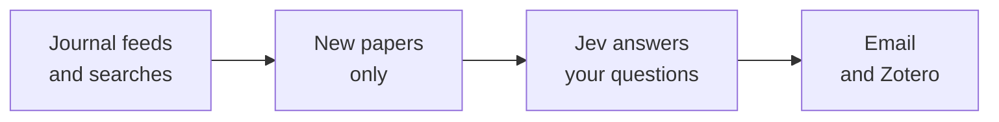

<div align="center">

<h1>Paper Round</h1>
<p><em>New journal papers that match your research, in your inbox every morning.</em></p>
</div>

<p align="center"></p>

Each morning Paper Round reads every new paper in the journals you follow, keeps the ones that fit your research,
and emails them to you. Each one comes with the sentence from its abstract that shows why it was kept, and kept papers
can go straight into Zotero too. I built it for my own PhD; anyone can run their own copy.

## How it works


```mermaid
flowchart LR
  A[Journal feeds<br/>and searches] --> B[New papers<br/>only]
  B --> C[Jev answers<br/>your questions]
  C --> D[Email<br/>and Zotero]
```

You describe your research in `scope.yaml` as a few yes/no questions. [Jev](https://typesafe.ai) answers them for
each paper, and the code keeps the ones that pass. The reason line is copied from the abstract, so nothing in the email
is made up.

## Setup

You need a GitHub account, a Jev key ([typesafe.ai](https://typesafe.ai)) and a free Resend key
([resend.com](https://resend.com)) for the email.

```bash
pip install "paper-round @ git+https://github.com/LaineyLouiseWard/paper-round@v2.0.0"
mkdir my-paper-round && cd my-paper-round && git init
paperround init
```

1. Edit `config.yaml` (journals, email, Zotero) and `scope.yaml` (your questions). The comments in each file say what goes where.
2. Run `paperround run --dry-run` to see which papers it finds.
3. Push to a private GitHub repo and add your keys under Settings → Secrets and variables → Actions:
   `TYPESAFE_API_KEY`, `RESEND_API_KEY`, and optionally `ZOTERO_API_KEY`.
4. Press Run on the Actions tab. From then on it runs every morning.

## Cost

Jev costs about a cent a day for 70 papers. A round takes a minute or two, well inside GitHub's free Actions minutes.

## Licence

MIT
